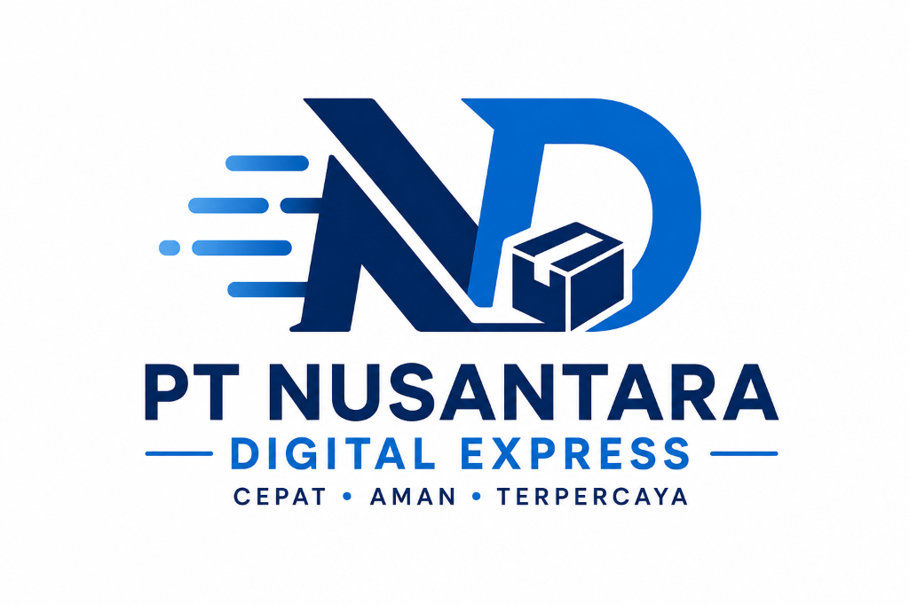
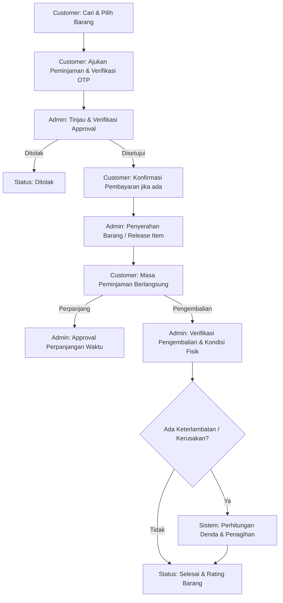

<div align="center">

  

  # 🏢 Enterprise Inventory & Asset Borrowing System
  ### **PT NUSANTARA DIGITAL EXPRESS**
  *Cepat • Aman • Terpercaya*

  ---

  [](https://laravel.com)
  [](https://www.php.net)
  [](https://mysql.com)
  [](LICENSE)
  [](https://github.com/arvaganteng/WEB-PINJAM-BARANG)

  <p align="center">
    <strong>Platform Sistem Informasi Manajemen Inventaris dan Alur Peminjaman Aset Perusahaan Terpadu berbasis Web secara Real-Time.</strong>
  </p>

  [📖 Ringkasan](#-tentang-sistem-system-overview) •
  [🔄 Alur Kerja](#-alur-kerja-sistem-system-workflow) •
  [✨ Fitur Utama](#-fitur-fitur-utama-key-features) •
  [🛠️ Arsitektur](#-arsitektur--teknologi-tech-stack) •
  [🚀 Cara Instalasi](#-panduan-instalasi--jalankan-getting-started) •
  [🔑 Kredensial Demo](#-akun-akses-demo-default-credentials)

</div>

---

## 📌 Tentang Sistem (System Overview)

**Sistem Peminjaman Barang & Inventaris PT Nusantara Digital Express** adalah aplikasi web tingkat perusahaan (*enterprise-grade*) yang dirancang khusus untuk mengoptimalisasi tata kelola inventarisasi, pemantauan status ketersediaan barang, serta pengawasan transaksi peminjaman aset perusahaan secara efisien, akurat, dan akuntabel.

Sistem ini memfasilitasi integrasi penuh antara **Pengaju (Karyawan / Customer)** dan **Pengelola (Admin Inventaris)** melalui fitur pengamanan OTP, perhitungan otomatis biaya dan denda keterlambatan, pembuatan bukti fisik berupa invoice PDF, serta pencatatan jejak audit (*Audit Trail/Activity Logs*).

---

## 🔄 Alur Kerja Sistem (System Workflow)



---

## ✨ Fitur-Fitur Utama (Key Features)

### 📊 Matriks Hak Akses & Kapabilitas Sistem

| Fitur / Kapabilitas | Administrator | Customer / Karyawan |
| :--- | :---: | :---: |
| Dashboard Analitik & Statistik Real-Time | 🛠️ Penuh | 👁️ Ringkasan |
| Manajemen Data Barang, Kategori & Kondisi (CRUD) | ✅ Ya | ❌ Tidak |
| Pencarian & Filter Katalog Barang | ✅ Ya | ✅ Ya |
| Pengajuan Peminjaman & Verifikasi OTP | ❌ Tidak | ✅ Ya |
| Approval & Verifikasi Pengajuan Peminjaman | ✅ Ya | ❌ Tidak |
| Penyerahan Barang (*Release Item*) | ✅ Ya | ❌ Tidak |
| Pengajuan Perpanjangan Durasi Pinjam | ❌ (Approve Only) | ✅ Ya |
| Verifikasi Pengembalian & Perhitungan Denda Otomatis | ✅ Ya | ❌ Tidak |
| Cetak Laporan PDF & Faktur Invoice Transaksi | ✅ Ya | ✅ Ya (Invoice Only) |
| System Activity Logs (Jejak Audit Traversal) | ✅ Ya | ❌ Tidak |

---

## 🛠️ Arsitektur & Teknologi (Tech Stack)

### Core Technologies
- **Core Framework**: [Laravel 11.x](https://laravel.com/) - Modern PHP Web Framework
- **Language**: PHP 8.2+
- **Database Engine**: MySQL / MariaDB Relational Database
- **Frontend Architecture**: Blade Templating Engine, Custom CSS Design Token, JavaScript ES6+
- **Document Engine**: DomPDF (`dompdf/dompdf`) untuk generasi Faktur Invoice & Laporan PDF

### Security & Compliance
- **Role-Based Access Control (RBAC)**: Middleware isolasi akses Admin dan Customer.
- **Two-Factor OTP Security**: Autentikasi kode OTP untuk validasi pengajuan peminjaman.
- **Audit Logging**: Logger transaksi terpisah (`ActivityLog`) untuk mencatat setiap aksi kritis pada sistem.

---

## 📁 Struktur Direktori Project (Directory Structure)

```text
WEB-PINJAM-BARANG/
├── app/
│   ├── Http/
│   │   ├── Controllers/
│   │   │   ├── Admin/          # Controller Administrasi (Item, Category, Borrowing, Return, Report, Fine)
│   │   │   ├── Customer/       # Controller Pengguna (Catalog, Borrowing, Fine, Profile)
│   │   │   └── AuthController  # Autentikasi Sistem & Validasi OTP
│   │   └── Middleware/         # Control Access Middleware (Role-Based)
│   └── Models/                 # Eloquent Models & Schema Relationships
├── database/
│   ├── migrations/             # Skema Tabel Database Relasional
│   └── seeders/                # Master Data & Initial State Seeder
├── public/
│   ├── images/                 # Aset Logo Perusahaan (logo.png) & Media Barang
│   └── storage/                # Symbolic Link ke Media Upload
├── resources/
│   └── views/                  # View Template HTML/Blade (Admin, Customer, Auth, PDF)
└── routes/
    └── web.php                 # Routing Registrasi Aplikasi
```

---

## 🚀 Panduan Instalasi & Jalankan (Getting Started)

### 1. Prasyarat Sistem
- PHP `>= 8.2` dengan ekstensi enabled (`pdo_mysql`, `mbstring`, `openssl`, `gd`)
- Composer `>= 2.x`
- Node.js `>= 18.x` & NPM
- MySQL / MariaDB Database Server

### 2. Tahap Instalasi

```bash
# 1. Clone repository dari GitHub
git clone https://github.com/arvaganteng/WEB-PINJAM-BARANG.git
cd WEB-PINJAM-BARANG

# 3. Install dependensi backend & frontend
composer install
npm install

# 3. Buat file konfigurasi lingkungan (.env)
cp .env.example .env

# 4. Generate Application Security Key
php artisan key:generate

# 5. Konfigurasi kredensial database pada .env
# DB_CONNECTION=mysql
# DB_HOST=127.0.0.1
# DB_PORT=3306
# DB_DATABASE=pinjam_barang
# DB_USERNAME=root
# DB_PASSWORD=

# 6. Jalankan Migrasi Tabel & Data Awal (Seeder)
php artisan migrate --seed

# 7. Hubungkan Storage Directory (Symlink)
php artisan storage:link

# 8. Jalankan Server Aplikasi & Asset Builder
php artisan serve
npm run dev
```

Aplikasi dapat diakses pada alamat URL: `http://127.0.0.1:8000`

---

## 🔑 Akun Akses Demo (Default Credentials)

Data akun sampel berikut secara otomatis dibuat saat menjalankan perintah `php artisan migrate --seed`:

| Role Access | Email Address | Default Password | URL Portal Login |
| :--- | :--- | :--- | :--- |
| 👨‍💼 **Administrator** | `admin@nde.co.id` | `password` | `/admin/login` |
| 👤 **Customer / Karyawan** | `budi@example.com` | `password` | `/login` |

---

## 📤 Cara Update Perubahan ke GitHub (Push to GitHub)

Jalankan perintah berikut pada terminal lokal Anda untuk mengirimkan pembaruan dokumentasi ini ke repository GitHub:

```bash
git add README.md public/images/logo.png
git commit -m "docs: enhance README with enterprise architecture, workflow diagram & corporate branding"
git push origin main
```

---

<div align="center">

  **PT NUSANTARA DIGITAL EXPRESS**<br>
  *Hak Cipta &copy; 2026. Seluruh hak cipta dilindungi undang-undang.*

</div>
